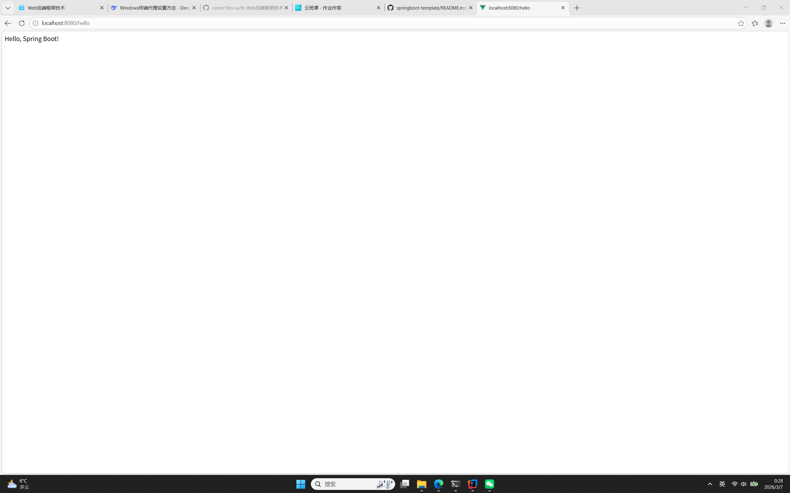

# Spring Boot 学习项目

## 项目说明
这是 Spring Boot 课程第一周作业，实现了基础的 Hello 接口。

## 技术栈
- Java 25
- Spring Boot 4.0.3
- Maven

## 项目结构
week01/
├── docs/ # 学习笔记
├── hello-sample/ # 项目代码
└── screenshots/ # 运行截图

text

## 接口列表
| 接口路径 | 方法 | 说明 |
|---------|------|------|
| /hello | GET | 返回 Hello, Spring Boot! |

## 运行方式
1. 克隆项目
2. 用 IDEA 打开
3. 运行 Test36pmApplication
4. 访问 http://localhost:8080/hello

## 截图
